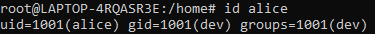

# Exercice 1. Gestion des utilisateurs et des groupes

1. Utilisez la commande groupadd pour créer deux groupes dev et infra  
Pour ajouter les groupes dev et infra il faut faire  
``` bash
groupadd dev ; groupadd infra 
```  
  
2. Créez ensuite 4 utilisateurs alice, bob, charlie, dave avec la commande useradd, en demandant la création de leur dossier personnel et avec bash pour shell  
Afin d'ajouter les 4 utiliseurs en demandant la création de leur dissier bash avec bahs il faut effectuer les commandes suivante pour chaque utilisateur
``` bash
 useradd -m alice
 usermod --shell /bin/bash alice
 
 useradd -m alice
 usermod --shell /bin/bash bob

 useradd -m alice
 usermod --shell /bin/bash charlie
 
 useradd -m alice
 usermod --shell /bin/bash dave
 
```  


3. Ajoutez les utilisateurs dans les groupes créés : alice, bob, dave dans dev // bob, charlie, dave dans infra  

``` bash

 usermod -a -G dev alice
 usermod -a -G dev bob 
 usermod -a -G dev dave
 

 usermod -a -G infra bob
 usermod -a -G infra charlie 
 usermod -a -G infra dave
 
```  


4. Donnez deux moyens d’afficher les membres de infra  
Les deux moyens pour afficher les membres de infra sont : 
``` bash

grep infra /etc/group

getent group dinfra

 ``` 
 
 
5. Faites de dev le groupe propriétaire des répertoires /home/alice et /home/bob et de infra le groupe
propriétaire de /home/charlie et /home/dave

Pour faire de dev le groupe prioritaire de bob et alice il faut faire : 

``` bash
   chgrp -R dev /home/alice
   chgrp -R dev /home/bob
   
 ```
 Pour faire de infra le groupe prioritaire de bob et alice il faut faire : 
 
 ``` bash
   chgrp -R infra /home/charlie
   chgrp -R infra /home/dave
   
 ```
 
 usermod -g dev alice

6. Remplacez le groupe primaire des utilisateurs :  dev pour alice et bob // infra pour charlie et dav

Pour faire de dev le groupe primaire de bob et alice il faut faire : 

``` bash
    usermod alice -g dev
    usermod bob -g dev
 ```
Pour faire de infra le groupe primaire de dave et charlie il faut faire : 
 
 ``` bash
    usermod charlie -g infra
    usermod dave -g infra
 ```
7. Créez deux répertoires /home/dev et /home/infra pour le contenu commun aux membres de chaque groupe, et mettez en place les permissions leur permettant d’écrire dans ces dossiers. 
Il faut créer deux répertoire : 
```bash
mkdir dev
mkdir infra

```
Il faut ensuite modifier le groupe cible du dossier : 
```bash
chgrp -R infra ./infra
chgrp -R dev ./dev
```
Ensuite pour ajuter les droit d'écriture sur le dossier au groupe il faut faire : 
```bash
chmod 720 dev
chmod 720 infra
```
On peut aussi autoriser les groupes a entrer dans le fichier en faisant : 
```bash
chmod 730 dev
chmod 730 infra
```


8. Comment faire pour que, dans ces dossiers, seul le propriétaire d’un fichier ait le droit de renommer
ou supprimer ce fichier ?  

Afin que seul le propriétaire du fichier est le droit de supprimer ou de renommer le fichier il faut faire la commande : 
```bash
 sudo chmod 700 dev
 sudo chmod 700 infra
```

9. Pouvez-vous ouvrir une session en tant que alice ? Pourquoi ?

On ne peut pas ouvrir une session en tant que Alice car aucun mot de passe n'a été défini

10. Activez le compte de l’utilisateur alice et vérifiez que vous pouvez désormais vous connecter avec son
compte.

Pour acctive le compte d'un utilisateur il faut lui ajouter un mot de passe qui en faisant la commande : 
```bash
passwd alice
```
Pour verifier la connexion il faut utiliser la commande : 
```bash
su alice
```


11. Comment obtenir l’uid et le gid de alice ?

Pour obtenir l'udi et le gid de Alice il faut effectuer la commande : 
```bash
id alice
```



12. Quelle commande permet de retrouver l’utilisateur dont l’uid est 1003 ?

La commande qui permet de trouver un utilisateur en fonction de son Id est : 

```bash
id 1003
```


13. Quel est l’id du groupe dev ?

Pour trouver l'ID du groupe dev il faut faire la commande suivante : 

```bash
grep dev /etc/group
```


14. Quel groupe a pour gid 1002 ?

Pour trouver le groupe dont l'ID est 1002 il faut faire la commande : 

```bash
grep 1002 /etc/group
```
15. Retirez l’utilisateur charlie du groupe infra. Que se passe-t-il ? Expliquez.

Pour retirer l'utilisateur du groupe il faut effectuer : 
gpasswd --delete charlie infra
```bash
gpasswd -d charlie infra
``` 
Après cela Charlie a toujours accès au différent groupe primaire et prioritaire état infra

16. Modifiez le compte de dave de sorte que :


 Pour que le compte expire au 1er juin 2021 : 
 ```bash
   chage -expiredate 2021-06-01 dave
 ``` 
 il faut changer de mot de passe avant 90 jours :
 ```bash
   chage -M 90 dave
 ``` 
 il faut attendre 5 jours pour modifier un mot de passe :
```bash
   chage -m 5 dave
``` 
 l’utilisateur est averti 14 jours avant l’expiration de son mot de passe :
```bash
  chage -W 14 dave
``` 
 le compte sera bloqué 30 jours après expiration du mot de passe : 
 ```bash                
   chage -I 30 dave
 ``` 


17. Quel est l’interpréteur de commandes (Shell) de l’utilisateur root ?

L'interpréteur qui est utilisé par l'utilisateur  root est bash

18. Si vous regardez la liste des comptes présents sur la machine, vous verrez qu’il en existe un nommé
nobody. A quoi correspond-il ?

Le compte nobdy est un compte qui n'a aucun fichier a lui qui n'est dans aucun groupe qui a des privilèges et dont les seules possibilités sont celles que tous les autres utilisateurs ont.

19. Par défaut, combien de temps la commande sudo conserve-t-elle votre mot de passe en mémoire ?
Quelle commande permet de forcer sudo à oublier votre mot de passe ?

La coommande sudo conserve en memoire notre mot de passe pendant 15 minutes

La commande ``` sudo -k ``` permet de forcer sudo a oublié le mot de passe 

# Exercice 2. Gestion des permissions

1. Dans votre $HOME, créez un dossier test, et dans ce dossier un fichier fichier contenant quelques lignes de texte. Quels sont les droits sur test et fichier ?

Les droit sur le dossier test sont :


Les droits sur le fichiier "fichier" sont : 


2. Retirez tous les droits sur ce fichier (même pour vous), puis essayez de le modifier et de l’afficher en tant que root. Conclusion ?

L'utilisateur peut toujours lire le fichier même en ayant enlever tous les droits. Donc en conclusion le compte aura toujours les droit sur les fichiers 


3. Redonnez vous les droits en écriture et exécution sur fichier puis exécutez la commande echo "echo Hello" > fichier. On a vu lors des TP précédents que cette commande remplace le contenu d’un fichier s’il existe déjà. Que peut-on dire au sujet des droits ?

En redonnant le droit en éxectution et en écriture on peut utiliser la commande e ``` echo "echo Hello" > fichier ``` et donc modifier le fichier mais on ne peut pas lire le fichier. 


4. Essayez d’exécuter le fichier. Est-ce que cela fonctionne ? Et avec sudo ? Expliquez. 
On ne peut pas éxécuter le fichier mais avec sudo cela marche. Nous n'avons pas le droit de lecture donc on ne peut pas voir le contenu du fichier, le résultat de son éxécution. 


5. Placez-vous dans le répertoire test, et retirez-vous le droit en lecture pour ce répertoire. Listez le contenu du répertoire, puis exécutez ou affichez le contenu du fichier fichier. Qu’en déduisez-vous ? Rétablissez le droit en lecture sur test.

Une fois le droit de lecture sur le dossier test enlever nous n'avons plus aucun accès au fichier on ne peut plus éxécuter le fichier. 
Enelever le droit de lecture a un dossier empêche toute accès au fichier du dossier.


6. Créez dans test un fichier nouveau ainsi qu’un répertoire sstest. Retirez au fichier nouveau et au répertoire test le droit en écriture. Tentez de modifier le fichier nouveau. Rétablissez ensuite le droit en écriture au répertoire test. Tentez de modifier le fichier nouveau, puis de le supprimer. Que pouvez-vous déduire de toutes ces manipulations ?

Quand on retire le droit en écriture au dossier test et au fichier nouveau nous ne pouvons pas modifier. De même lorsqu'on rétablie le droit en écrit. 
On peut en déduire donc que le droit  d'écriture permet sur le dossier concerne la supression des fichier présent dans le dossier. 


7. Positionnez vous dans votre répertoire personnel, puis retirez le droit en exécution du répertoire test. Tentez de créer, supprimer, ou modifier un fichier dans le répertoire test, de vous y déplacer, d’en lister le contenu, etc…Qu’en déduisez vous quant au sens du droit en exécution pour les répertoires ?

En suprimmant le droit d'execution sur le dossier on ne peut n'y accèder au dossier mais on ne peut pas aussi créer, supprimer, ou modifier un fichier 

8. Rétablissez le droit en exécution du répertoire test. Positionnez vous dans ce répertoire et retirez lui à nouveau le droit d’exécution. Essayez de créer, supprimer et modifier un fichier dans le répertoire test, de vous déplacer dans ssrep, de lister son contenu. Qu’en concluez-vous quant à l’influence des droits que l’on possède sur le répertoire courant ? Peut-on retourner dans le répertoire parent avec ”cd ..” ? Pouvez-vous donner une explication ?


9. Rétablissez le droit en exécution du répertoire test. Attribuez au fichier fichier les droits suffisants pour qu’une autre personne de votre groupe puisse y accéder en lecture, mais pas en écriture.

Pour qu'un autre personne de mon groupe puisse accèder au fichier "fichier" en lecture mais pas en écriture il faut effectuer la commande : 
```bash
chmod 
```


10. Définissez un umask très restrictif qui interdit à quiconque à part vous l’accès en lecture ou en écriture, ainsi que la traversée de vos répertoires. Testez sur un nouveau fichier et un nouveau répertoire.

Afin de définir un  umask très restrictif qui interdit à quiconque à part a nous l’accès en lecture ou en écriture, ainsi que la traversée de nos répertoires. il faut effectuer la commande suivante. 
```
umask 077

```


11. Définissez un umask très permissif qui autorise tout le monde à lire vos fichiers et traverser vos répertoires, mais n’autorise que vous à écrire. Testez sur un nouveau fichier et un nouveau répertoire.

Afin d'avoir un  umask très permissif qui autorise tout le monde à lire mes fichiers et traverser mes répertoires, mais n’autorise que moi à écrire. Il faut faire la commande : 
```
umask 022
```
Il faut que les droit soit ``` rw. r.. r.e ``` pour les dossiers  et ``` rw. r.. r.. ``` pour les fichiers 


12. Définissez un umask équilibré qui vous autorise un accès complet et autorise un accès en lecture aux membres de votre groupe. Testez sur un nouveau fichier et un nouveau répertoire.

Afin d'avoir un umask équilibré qui vous autorise un accès complet et autorise un accès en lecture aux membres de mon groupe. Il faut faire la commande suivante 
```
umask 037

```


13. Transcrivez les commandes suivantes de la notation classique à la notation octale ou vice-versa (vous
pourrez vous aider de la commande stat pour valider vos réponses) :

Pour chmod u=rx,g=wx,o=r fic correspond a  ``` chmod 534 fic ``` en version octale

Pour chmod uo+w,g-rx fic en sachant que les droits initiaux de fic sont r--r-x--- correspond ```chmod 600 fic``` en version octale

Pour chmod 653 fic en sachant que les droits initiaux de fic sont 711 correspond ``` rw-r-x-wx ``` en version classique 

Pourchmod u+x,g=w,o-r fic en sachant que les droits initiaux de fic sont r--r-x--- correspond ``` chmod 520 fic ``` en version octale


